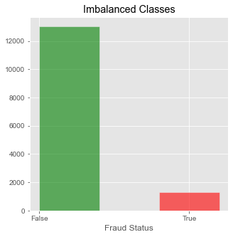
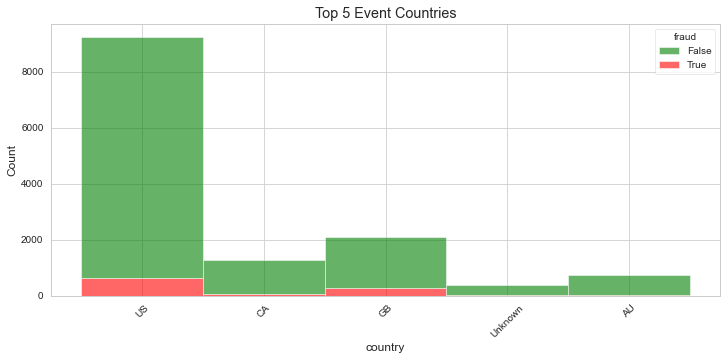
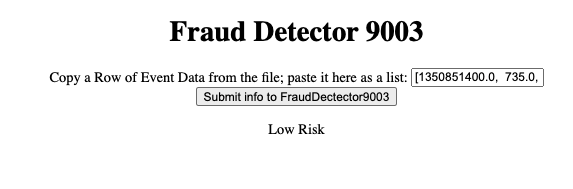
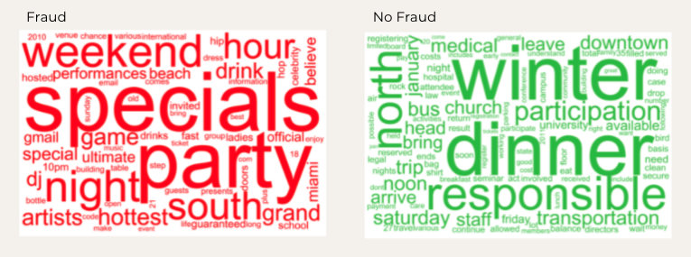
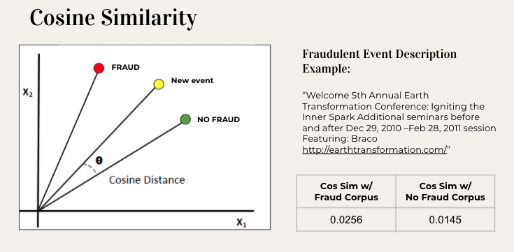

# Galvanize DSI Fraud Detection Case Study #

[Becky Peters](https://github.com/beckyepeters)

[Matthew Best](https://github.com/bestmatthew)

[Tony Nguyen](https://github.com/tonyn513)

Galvanize School - August 2021

[Presentation Slides](https://docs.google.com/presentation/d/1dpa3oKvp2XuNfvDFgcGies4ufp-jwB7H2DN3XJqLj2A/edit?usp=sharing)

+++++

[Presentation Video](https://youtu.be/w7iBL8Y5tfc)

## Background and Motivation 
Late-stage Galvanize school project using supervised machine learning for fraud detection. The dataset includes fraudulent and legitimate events from a virtual event host with each transaction representing a ticket sale. 

Roughly 91% of the events in the dataset were legitimate (Fraud = False), while 9.1% of the events were fraudulent (Fraud = True). This introduces a problem of imbalanced classes for our classificaiton algorithm. 

Figure 1: Imbalanced Representation of Fraud vs. Non-Fraud Classes

The dataset began with 14,337 entries and 44 features of varied types, including both numeric and textual information.   

Figure 2: Event Types Included in Dataset

Initial Exploratory Data Analysis indicated relatively even distribution for features such as body length (length of text in description field), channels, location, etc. top5

Figure 3: Event Types in Top 5 Countries Represented in the Data

Figure 4: Event Name Length Distributions among Fraudulent and Legitimate Events

## Cleaning and Modeling the Data

Some key insights were made about the actual language within the event descriptions. That is, we suspected that longer, wordier titles with unnecessary and excessive capital letters may be suspicious and cause for concern. Features were engineerde to evaluate text entries from both the name and description of the event were evaluated for presence of punctuation and capitalization (both as a percentage of characters) with reliable results.   

Using a stratified train-test-split, we then began experimenting with different algorithms for fraud classification. The Random Forest classifier performed the best with an Accuracy of 97.6%, Precision at 92.7% and Recall at 76.0%. (Baseline metrics for this classification would be 91% accuracy, 0% precision and 0% recall if we were to classify all events as "Not Fraud")

In order to balance false negatives and false positive predictions for our investigators, we fine-tuned our classification model threshold to bring both precision and recall to 84% while maintaining a 97% accuracy. 

We also created a Flask app (in local development) which will assign events a high-, medium-, or low-risk label for our investigators. 

Figure 5: Flask app Screen Shot of prediction

Finally, Natural Language Processing on the "Fraud" event corpus and the "Not Fraud" event corpus to see if further determinations could be made using cosine similarity for a new event under investigation. Word clouds from the descriptions of the two types of events showed marked differences: 

Figure 6: Word Clouds for Event Descriptions

We then used cosine similarity to evaluate a new event description's similarity to the fraud or non-fraud corpus, as an additional data point for investigators to consider. 

Figure 7: Cosine Similarity example

## Conclusions and Future Work 
The high / medium / low risk threshold seems a good starting point for investigators of fraud. For future additions to this project, we could add the cosine similarity feature to the dashboard, make the threshold customizable to modify the prediction classification for the user, and make the model updatable with new event information. 

